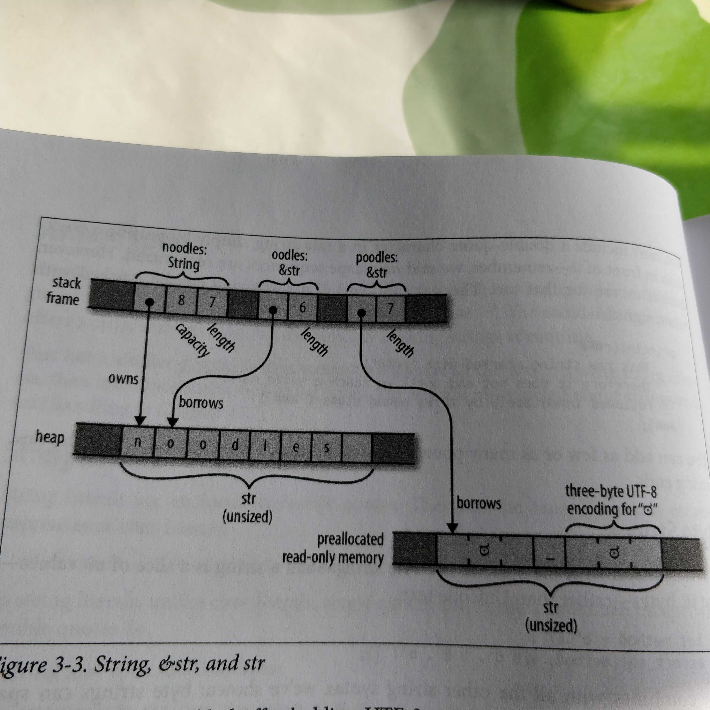

# About memory size of String/vec and &str/slice

A figure illustration from book Programming Rust:

```rust
let noodles = "noodles".to_string();
let oodles = &noodles[1..];
let poodles = "好_吃";

assert_eq!("好_吃".len(), 7);
assert_eq!("好_吃".chars().count(), 3);
```
